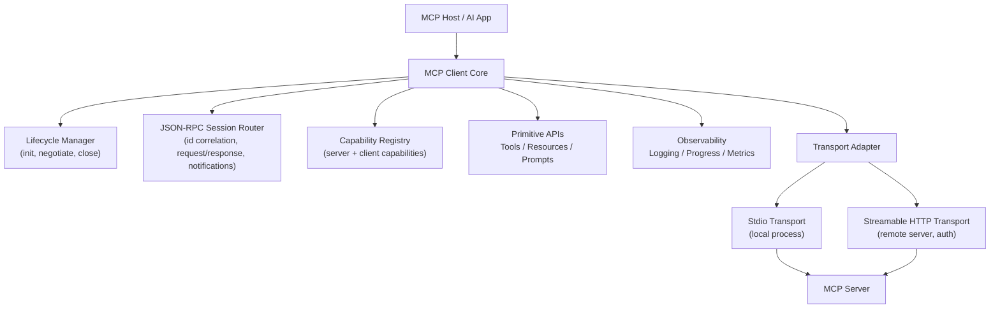
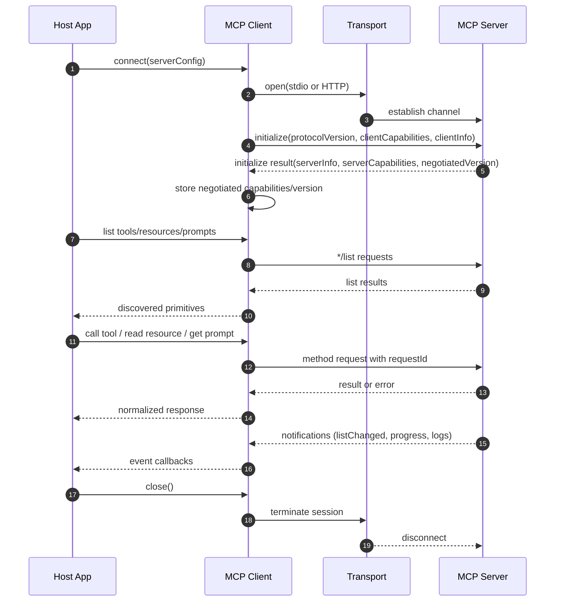

# MCP Client Software Design (Learning Notes)

This document summarizes a practical software design for building an MCP (Model Context Protocol) client, based on public resources (Model Context Protocol docs/spec and SDK guides).

## Goals

- Build a client that can connect to local or remote MCP servers.
- Negotiate protocol version and capabilities safely.
- Discover and invoke server primitives (tools, resources, prompts).
- Handle notifications, progress updates, errors, and reconnects robustly.

## High-Level Architecture

## Design Layers

1. **Transport layer**
   - Handles bytes/frames, connection setup, auth headers/tokens, and shutdown.
   - Supports:
     - **Stdio** for local process communication.
     - **Streamable HTTP** (+ optional SSE streaming) for remote servers.

2. **Protocol/data layer (JSON-RPC 2.0)**
   - Request/response dispatch with unique request IDs.
   - Notification handling (no response expected).
   - Timeout and cancellation behavior.

3. **MCP domain layer**
   - Lifecycle (`initialize`, negotiated version, shutdown).
   - Primitive operations:
     - `tools/list`, `tools/call`
     - `resources/list`, `resources/read`
     - `prompts/list`, `prompts/get`
   - Client features exposed to server if supported (sampling, elicitation, logging hooks).

4. **Host integration layer**
   - Maps discovered tools/resources/prompts into your app UX and agent runtime.
   - Applies policy checks and trust restrictions before tool execution.

## Session Lifecycle

## Capability Negotiation Pattern

- Client sends supported protocol version(s) and client capabilities in `initialize`.
- Server returns chosen protocol version and server capabilities.
- Client gates behavior based on negotiated capabilities:
  - If `tools` unsupported, hide/disable tool invocation paths.
  - If `resources` unsupported, skip resource browsing logic.
  - If `prompts` unsupported, do not query prompt catalog.
- Fail fast if no compatible protocol version is available.

## Core Runtime Flows

### 1) Discovery flow

- On successful init, call list endpoints.
- Cache results with optional refresh on `listChanged` notifications.
- Prefer lazy refresh to avoid excessive traffic.

### 2) Invocation flow

- Build validated request payload.
- Send JSON-RPC request with unique ID.
- Track request in an in-flight map for correlation.
- Return parsed result (including `content` and optional structured data).
- Surface typed errors to host.

### 3) Notification flow

- Handle server notifications without blocking request path:
  - tool/resource/prompt list change events
  - progress notifications for long operations
  - logging notifications for diagnostics
- Dispatch notifications through event handlers/callbacks in client core.

## Error Handling Strategy

- **Transport errors**: connection dropped, auth failures, handshake failures.
- **Protocol errors**: malformed JSON-RPC, unknown methods, invalid params.
- **Domain errors**: tool execution failures, missing resources/prompts.
- Keep errors explicit and typed; avoid silent fallbacks.
- Add request timeout controls, and optionally reset timeout when progress events arrive.

## Reconnection & Reliability

- Treat client as a finite-state machine:
  - `Disconnected -> Connecting -> Initializing -> Ready -> Closing -> Disconnected`
- On transient remote failures:
  - retry with bounded exponential backoff
  - re-run initialize
  - refresh primitive catalogs
- Ensure idempotent cleanup:
  - close transport session
  - reject/complete all in-flight requests
  - clear temporary subscriptions

## Security & Trust Boundaries

- For remote HTTP servers:
  - use secure auth (OAuth/token-based flows as supported)
  - apply TLS and endpoint validation
  - minimize scopes and privileges
- Assume tools can have side effects:
  - enforce allow-lists/policy checks before `tools/call`
  - log sensitive actions
- Validate incoming data before rendering or passing into host systems.

## Suggested Implementation Modules

- `ITransport` (`connect`, `send`, `onMessage`, `close`)
- `JsonRpcSession` (ID generation, dispatch, correlation, timeout)
- `LifecycleManager` (`initialize`, negotiated state, shutdown)
- `CapabilityRegistry` (feature gating)
- `ToolsClient`, `ResourcesClient`, `PromptsClient`
- `NotificationHub` (progress/log/listChanged events)
- `ConnectionSupervisor` (retry/reconnect policy)

## Practical Build Order

1. Implement transport adapters (stdio + streamable HTTP).
2. Implement JSON-RPC session with request correlation and notifications.
3. Implement initialization + negotiated capability registry.
4. Add primitive APIs (`list` first, then execution/read/get paths).
5. Add observability and robust error typing.
6. Add reconnect supervisor and cleanup guarantees.

## Reference Sources

- MCP Introduction and docs: `https://modelcontextprotocol.io/introduction`
- MCP Architecture: `https://modelcontextprotocol.io/docs/learn/architecture`
- MCP Specification index/versioning: `https://modelcontextprotocol.io/specification`
- Context7 library IDs:
  - `/modelcontextprotocol/specification`
  - `/modelcontextprotocol/typescript-sdk`

