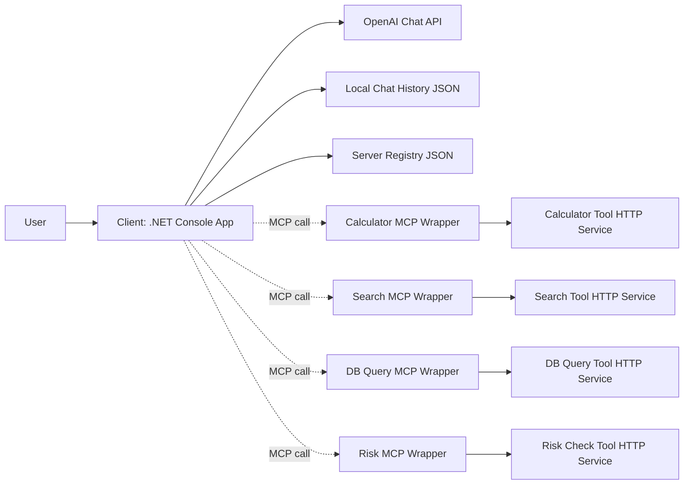
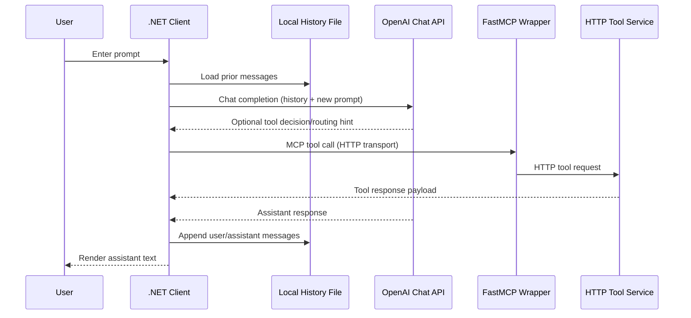

# High-Level Design

## Description

System-level architecture for the MCP PoC with major components and interactions.

## Goal Of This File

Define the big picture so implementation stays aligned with intended behavior and boundaries.

## Success Looks Like

A new contributor can understand the architecture, data flow, and top-level trade-offs without reading code.

## Problem Statement

We need a first working iteration for MCP research with two independent projects:
- A client app that sends user input to an OpenAI reasoning model.
- A local set of MCP-like HTTP tool services for transport and routing experiments.

The immediate goal is to establish structure, interfaces, and a repeatable iteration workflow.

## Goals

- Create clear separation between client and server repositories/directories.
- Provide a runnable client baseline for prompt/response experimentation.
- Provide four runnable HTTP tool simulations to test MCP-style transport.
- Capture architecture and interaction flow in diagrams.
- Keep the first iteration small and observable.

## Non-Goals

- Implement full production MCP server runtime.
- Implement tool routing or policy engine runtime.
- Add production hardening, auth layers, or deployment automation.

## System Context

The user interacts with a local .NET console client.  
The client calls OpenAI Chat API via the OpenAI .NET SDK for reasoning output.  
The client persists user/assistant history locally to preserve context across turns and runs.  
The client also loads server access metadata from a local server registry file with hot reload.  
The server side provides four local HTTP tool services containerized with Docker Compose.  
FastMCP wrapper servers expose those tools via MCP HTTP endpoints.

## Core Components

- Client Console App
  - Reads user prompt from terminal.
  - Loads/saves persistent chat history.
  - Includes MCP client core for `initialize`, `tools/list`, and `tools/call` over MCP HTTP transport.
  - Sends request with conversation context to OpenAI provider.
  - Prints model output to terminal.
- OpenAI Provider Integration
  - Uses `OPENAI_API_KEY`, optional `OPENAI_MODEL`, and optional `OPENAI_CHAT_HISTORY_PATH`.
  - Uses OpenAI .NET SDK `ChatClient` for chat completion calls.
- Local History Store
  - JSON file containing user/assistant message history.
  - Default path: `.openai-chat-history.json` (project root unless overridden).
- Server Registry Store
  - JSON file containing per-server metadata and routing tags.
  - Entry fields include stable server ID, logical name, transport, endpoint/command, author, capabilities, priority, health policy, tags, and version.
  - Supports hot reload from filesystem.
- Tool Service Layer (HTTP, Python, containerized)
  - `calculator_tool`: arithmetic endpoints including add-multiple.
  - `search_tool`: keyword search over local movie JSON documents.
  - `db_query_tool`: read-only SQLite `SELECT` query endpoint.
  - `risk_check_tool`: simple finance-like static rule checker.
  - Orchestrated with `docker-compose.yml` for local multi-service startup.
- MCP Wrapper Layer (FastMCP, HTTP transport)
  - One wrapper server per tool service.
  - Exposes MCP tools and delegates execution to local HTTP tool service endpoints.
  - Supports environment-based transport/port/base URL configuration.

## End-to-End Flow

## Risks and Trade-Offs

- Trade-off accepted: local file-backed memory for simplicity over shared/distributed memory.
- Trade-off accepted: file-backed server registry for PoC speed over centralized DB/service registry.
- Risk: unbounded history growth may increase prompt tokens and cost.
- Mitigation: keep model configurable and introduce truncation/summarization in a future iteration.
- Trade-off accepted: tool services are intentionally simple and deterministic.
- Risk: no auth/rate limit between local services.
- Mitigation: keep scope local-only for current research iteration.
- Trade-off accepted: wrapper layer introduces one extra network hop.
- Mitigation: maintain simple local topology and explicit per-service ports.
