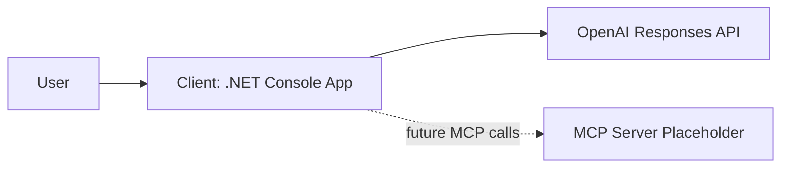
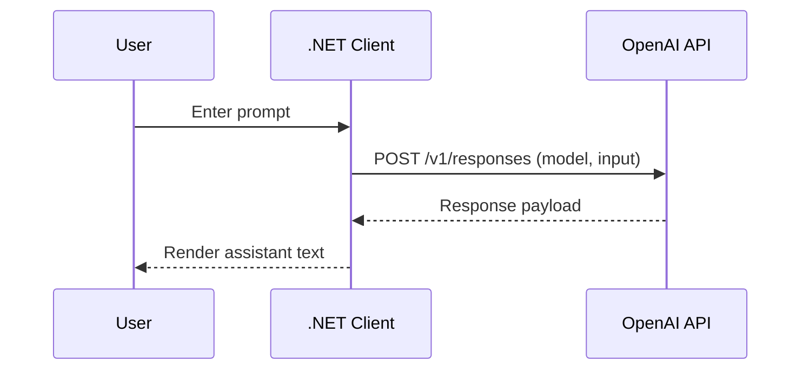

# High-Level Design

## Description

System-level architecture for the MCP PoC with major components and interactions.

## Goal Of This File

Define the big picture so implementation stays aligned with intended behavior and boundaries.

## Success Looks Like

A new contributor can understand the architecture, data flow, and top-level trade-offs without reading code.

## Problem Statement

We need a first working iteration for MCP research with two independent projects:
- A client app that sends user input to an OpenAI reasoning model.
- An MCP server project placeholder to be implemented in later iterations.

The immediate goal is to establish structure, interfaces, and a repeatable iteration workflow.

## Goals

- Create clear separation between client and server repositories/directories.
- Provide a runnable client baseline for prompt/response experimentation.
- Capture architecture and interaction flow in diagrams.
- Keep the first iteration small and observable.

## Non-Goals

- Implement full MCP server logic.
- Implement tool routing, policy engine runtime, or persistent memory.
- Add production hardening, auth layers, or deployment automation.

## System Context

The user interacts with a local .NET console client.  
The client calls OpenAI Responses API for reasoning output.  
A separate server project directory exists as a placeholder and target for the next iteration.

## Core Components

- Client Console App
  - Reads user prompt from terminal.
  - Sends request to OpenAI provider.
  - Prints model output to terminal.
- OpenAI Provider Integration
  - Uses `OPENAI_API_KEY` and optional `OPENAI_MODEL`.
  - Uses HTTP request to `v1/responses`.
- MCP Server Placeholder
  - Separate directory with minimal scaffolding notes.
  - No runtime behavior yet.

## End-to-End Flow

## Risks and Trade-Offs

- Trade-off accepted: direct REST integration (no SDK) for low setup friction.
- Risk: response format changes may require parser updates.
- Mitigation: keep model configurable and parsing conservative.
- Trade-off accepted: server kept empty to prioritize client baseline first.
